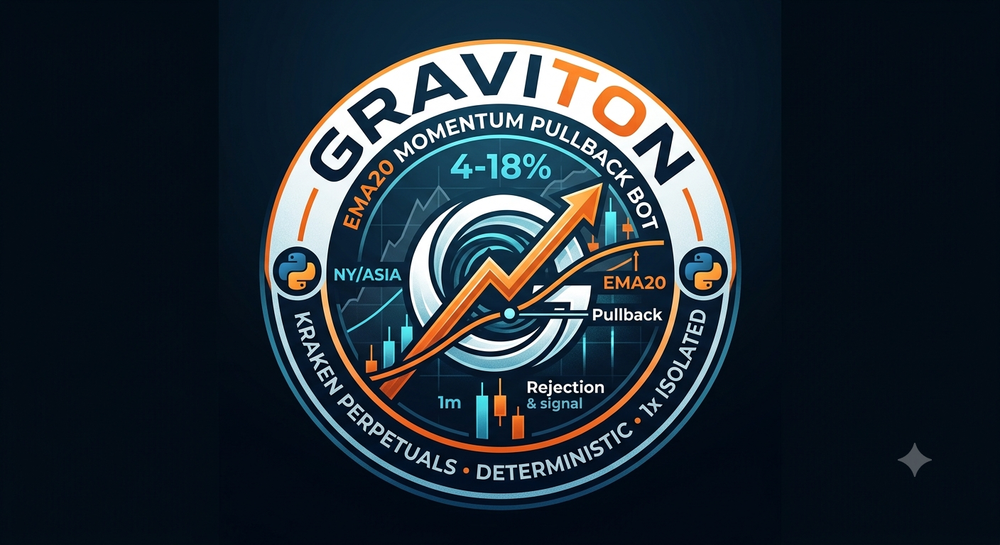

# Graviton — EMA20 Momentum Pullback Bot

<p align="center">
  
</p>

Graviton trades crypto perpetuals on Kraken by hunting momentum pullbacks
to the EMA20. It scans for coins with strong intraday moves (4–18% / 24h),
confirms directional bias from the first 15m candle after session open,
then enters on 1m timeframe when price gravitates back to the EMA20 line
and shows a rejection signal.

- **Sessions:** NY (13:30–16:00 UTC) and Asia (00:00–02:00 UTC)
- **Exchange:** Kraken Perpetuals via CCXT (308 USD linear perps)
- **Leverage:** 1x Isolated
- **Mode:** Dry-Run by default (`DRY_RUN = True`)
- **No LLM. Pure Python. Deterministic signals.**

## Strategy

```
Scan (30m before) → Bias (15m candle) → Entry (1m EMA20 Pullback) → Exit (3 Levels)
```

### 1. Scan — Momentum Filter (30 min before session)

- 24h Change: 4% – 18%
- 24h Volume: > $750,000 USD
- Max 8 coins on watchlist
- Sorted by abs(change) descending

### 2. Bias — Directional Analysis (16 min after session open)

- **1 closed 15m candle** → LONG / SHORT / NOISE (früher: 2 Kerzen / 31 Min)
- Daily-Trend-Kontext: +6% auf 24h + kleine rote Session-Kerze = LONG-Pullback
- RSI guard: RSI > 80 blocks LONG, RSI < 20 blocks SHORT
- **Früher Bias (16 Min statt 31 Min)** gibt 15 Min mehr Entry-Zeit

### 3. Entry — EMA20 Pullback (1m chart, during session)

- Wait for price to pull back near EMA20 (< 0.50% distance, < 0.80% im Fast Mode)
- Confirm rejection candle at EMA20
- **Fast Mode (erste 30 Min nach Open):**
  - 0.80% Entry-Distanz (weiter gefasst für Börsenöffnung)
  - Polling alle 15s statt 30s
  - Kein Volumen-Filter (1.0× statt 1.2×)
- **SL: 1H-ATR-basiert** (30% des 1H ATR, min 0.3%) — dynamisch pro Coin
  - Früher: fix 0.20% vom Kerzen-Low → zu eng für volatile Coins
  - Jetzt: `last_close * (1 - max(ATR_1h * 0.3, 0.3%))`
- 1 position per session, 1 coin
- Position size: ~$100 (17.5% of equity)

### 4. Exit — 3 Levels

| Level | Trigger | Action | SL After |
|-------|---------|--------|----------|
| **1/3** | Candlestick reversal pattern (e.g., Shooting Star, Engulfing) or +1% profit lock | Close 50% | Move SL to entry (break-even) + Trailing |
| **2/3** | EMA overextended (>2.5%), S/R reached, RSI extreme, Trailing Stop hit, or original SL | Close 100% | — |
| **3/3** | Session end (16:00 NY / 02:00 Asia UTC) | Force close all | — |

### Telegram Updates

Every key event is delivered live via Telegram:
```
🧠 [NY] Bias: 🟢 NEAR: LONG | RSI 58.3
👁 [NY] Entry-Polling NEAR (LONG) — alle 15s
🎯 [DRY RUN] ENTRY LONG NEAR @ 1.923 | SL 1.919
📤 [DRY RUN] EXIT 50% LONG NEAR — Pattern: Shooting Star → SL auf Break-Even
✅ [NY] Session Ende
```

## Project Structure

```
graviton/
├── session.py           # Full session runner (Bias → Entry → Watcher → Close)
├── config.py            # All parameters (sessions, filters, sizing, exit)
├── scanner.py           # Kraken Futures screener via CCXT
├── bias.py              # 15m directional bias (Wilder's RSI)
├── entry.py             # 1m EMA20 pullback entry + rejection detection
├── exit.py              # 3-level exit engine (Pattern / Structural / Session)
├── sr_levels.py         # Weekly/Daily support & resistance
├── patterns.py          # Candlestick pattern detection (ta-lib + pure fallback)
├── trader.py            # CCXT Kraken Futures order execution (open/SL/close)
├── watcher.py           # Position monitor + trailing stop
├── telegram_sender.py   # Direct Telegram Bot API for live updates
├── scripts/
│   ├── list_kraken_perps.py
│   └── scan_cron.sh
├── data/                # Runtime data (watchlist.json, entry state)
├── logs/
├── requirements.txt
├── GravitonLogo.png
└── README.md
```

## Setup

```bash
# 1. Clone
git clone https://github.com/micimokus8/graviton.git
cd graviton

# 2. Create venv + install
python3 -m venv .venv
source .venv/bin/activate
pip install -r requirements.txt

# 3. Configure API keys
cp .env.example .env
# Edit .env:
#   KRAKEN_API_KEY=your_key_here
#   KRAKEN_API_SECRET=your_secret_here
#   EQUITY_USD=200

# 4. List perpetuals
python scripts/list_kraken_perps.py
# → 308 USD linear perps on Kraken Futures

# 5. Test scan
python scanner.py
```

## Usage

```bash
# Scanner only (no API keys needed)
python scanner.py

# List all Kraken perpetuals
python scanner.py --list-perps

# Full session (dry run — no real money)
python session.py ny

# Full session (Asia)
python session.py asia

# Test Telegram sender
python telegram_sender.py
```

### Live Mode

Set `DRY_RUN = False` in `config.py` to enable live trading.  
Start with dry-run first for at least one week.

## Cron Jobs (Hermes Agent)

```
Job              UTC     CEST    Schedule
───────────────  ──────  ──────  ────────
NY Bias          14:01   16:01   daily
NY Session       14:02   16:02   daily
NY Scan (pre)    13:00   15:00   daily  → watchlist für Bias
Asia Scan        23:30   01:30   daily (paused)
Asia Session     00:00   02:00   daily (paused)
```

- **Scan** saves watchlist to `data/watchlist.json`
- **Bias** läuft 16 Min nach Session-Open (1 geschlossene 15m Kerze)
- **Session** startet direkt: Bias → Entry Polling (Fast Mode 15s) → Watcher → Close
- Empty watchlist → session skips automatically

## Configuration

All parameters in `config.py`:

| Section | Key | Value | Description |
|---------|-----|-------|-------------|
| DRY_RUN | — | `True` | No live orders |
| SESSIONS | ny/asia | 13:30/00:00 | Session open/close times UTC |
| SCAN | min/max_change_pct | 4.0 / 18.0 | 24h change filter |
| SCAN | min_volume_eur | 750_000 | Min volume filter |
| BIAS | min_candles | 2 | Candles needed for bias |
| BIAS | rsi_long_max/short_min | 80 / 20 | RSI block thresholds |
| ENTRY | ema_period | 20 | EMA length |
| ENTRY | ema_smoothing | 9 | SMA smoothing over EMA |
| ENTRY | **ema_distance_max** | **0.50** | Max % distance for entry (früher 0.30) |
| ENTRY | **fast_entry_distance** | **0.80** | Entry-Distanz in Fast Mode (erste 30 Min) |
| ENTRY | sl_offset_pct | 0.20 | Fallback SL offset (wird von 1H-ATR überschrieben) |
| ENTRY | max_parallel_coins | 1 | Coins per session |
| SR | min_distance_pct | 0.50 | Min % to nearest S/R |
| POSITION | account_risk_pct_per_coin | 17.5 | ~$100 at $570 equity |
| EXIT | ema_overextended_pct | 2.50 | Structural exit trigger |
| EXIT | trailing_pct | 0.30 | Trailing stop distance |
| EXIT | rsi_extreme_long/short | 78 / 22 | RSI extreme exit |

### Eingeführte Änderungen (Juli 2026)

| Änderung | Alt | Neu | Grund |
|----------|-----|-----|-------|
| **Bias-Timing** | 31 Min nach Open (2 Kerzen) | **16 Min** (1 Kerze) | 15 Min mehr Entry-Zeit |
| **Entry-Distanz** | 0.30% | **0.50%** (Fast: 0.80%) | Coins atmen 1%+ pro 1m Kerze |
| **SL-Berechnung** | fix 0.20% vom Kerzen-Low | **1H-ATR × 30%** (min 0.3%) | Dynamisch pro Coin-Volatilität |
| **Polling** | alle 30s | **15s** in Fast Mode | Schneller Entry bei Börsenöffnung |
| **Volumen-Filter** | 1.2× | **1.0×** in Fast Mode | Early Momentum ohne Volume-Hürde |
| **Fast Mode** | — | erste **30 Min** nach Open | Extra-Push für Börsenöffnung |

## API Keys

Create Kraken Futures API keys at https://www.kraken.com/u/security/api

Required permission: **Futures Trading** (not Spot)

## Requirements

```
ccxt>=4.4.0
numpy>=1.26.0
python-dotenv>=1.0.0
TA-Lib>=0.4.28
```

## Disclaimer

This bot executes real trades. Use at your own risk.
Start with small capital (min. 100 USD, recommended 200 USD).
Always test with `DRY_RUN = True` first.